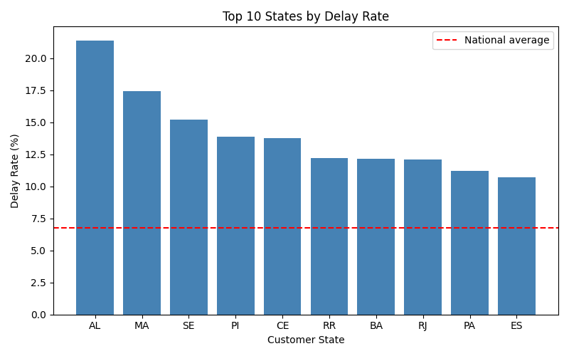
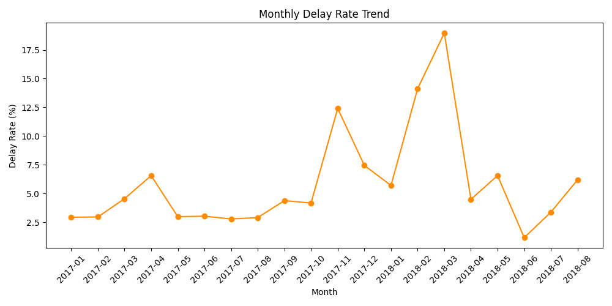
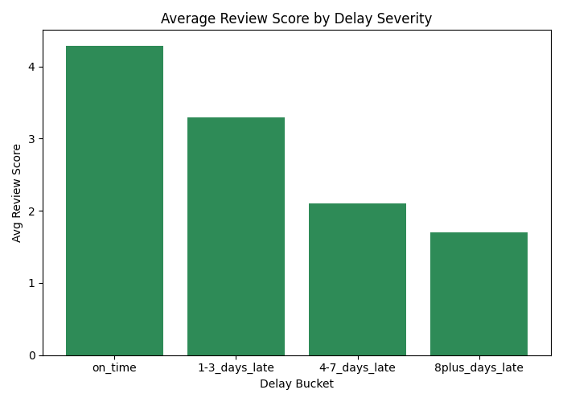
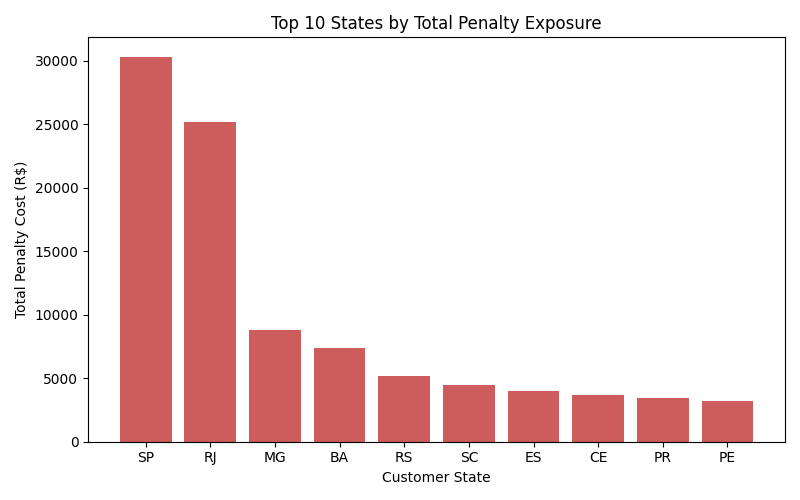
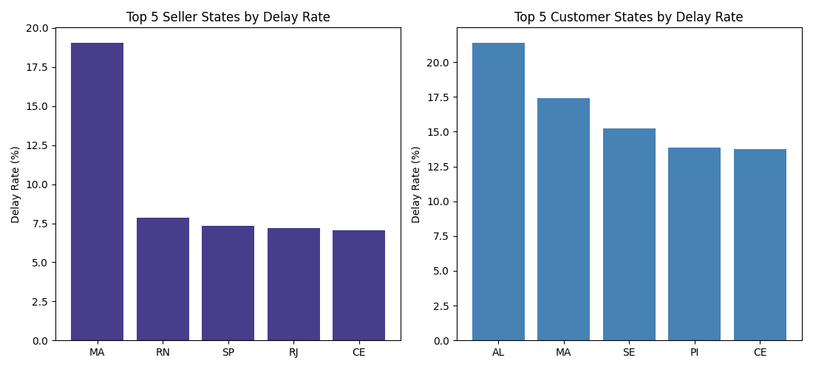

# Supply Chain Delay Analysis

## Business Problem

Olist is a Brazilian e-commerce platform that connects sellers to customers across the country. Some orders arrive later than the delivery date promised to the customer. Every late order carries a cost: possible penalty exposure and a drop in customer satisfaction that can affect repeat purchases.

This project answers three questions for an Operations/Logistics Manager:

1. Where do delays concentrate (which states, which sellers)?
2. Is the delay pattern seasonal or a structural fulfillment problem?
3. What does a late delivery actually cost the business, and which orders need urgent attention?

## Data

Five raw datasets from Olist's public e-commerce data (2016 to 2018):

- orders (99,441 rows) - order status and dates
- order_items (112,650 rows) - price, freight, seller per item
- order_reviews (99,224 rows) - customer review scores
- customers (99,441 rows) - customer location
- sellers (3,095 rows) - seller location

Only delivered orders with a valid delivery date were used for delay analysis. This left 96,470 orders (97% of the total dataset). The remaining 3% were canceled, unavailable, or still in transit, so no delay could be calculated for them.

## Approach and Tools

**Python (Pandas)** - loaded and audited the raw data, merged the five tables into one master table, and engineered 8 features including delay flag, delay bucket, seasonality flag, and an estimated penalty cost.

**Statistical testing (SciPy)** - before looking at the results, four hypotheses were written down and tested: does delay vary by state, does the festive season have more delays, does delay affect review scores, and does the seller's state matter independently of the customer's state.

**MySQL** - wrote 7 queries to answer specific operational questions: state rankings, monthly trend, seller rankings, review score by delay severity, cross-state shipping risk, financial exposure by state, and a prioritized outreach list.

**Visualizations (Matplotlib)** - built 5 charts to show the answers to each business question visually: delay rate by state, monthly delay trend, review score by delay severity, financial exposure by state, and seller-state vs customer-state delay rate.

Before starting the analysis, the raw data was checked for issues rather than assumed to be clean. This audit caught a known Olist data quirk (order volume in Sep-Oct 2018 drops to almost nothing because data collection stopped, not because delays improved) and a genuine data inconsistency (8 orders marked "delivered" with no delivery date on record). During the SQL load, a separate bug was found: empty review scores loaded as 0 instead of NULL, which was silently pulling down average review calculations. This was caught by comparing SQL output against the Python output, and fixed with an UPDATE query.

The same "check before trusting a number" habit was applied to the charts. The monthly trend chart initially showed a misleading 100% delay rate in September 2016, traced to a single order in that month. Similarly, Amazonas showed a 33% seller-side delay rate, traced to only 3 orders. Both were excluded using a minimum order-count threshold, the same approach already used for the seller ranking query in SQL (Q3).

## Project Structure

```
supply-chain-delay-analysis/
│
├── data/
│   ├── raw/                          # 5 original Olist CSV files
│   └── processed/
│       ├── master_table.csv          # after merge + clean
│       └── master_table_features.csv # after feature engineering
│
├── scripts/
│   ├── 01_data_quality_audit.py      # Step 1: check raw data before touching it
│   ├── 02_merge_clean.py             # Step 2: filter, dedupe, merge into one table
│   ├── 03_feature_engineering.py     # Step 3: build 8 analysis columns
│   ├── 04_statistical_tests.py       # Step 4: test 4 hypotheses
│   └── 05_visualizations.py          # Step 6: build 5 charts for the business questions
│
├── sql/
│   ├── 00_create_table.sql           # create MySQL table
│   ├── 00_load_data.sql              # bulk load CSV into MySQL
│   ├── 01_data_cleaning.sql          # fix NULL handling bug from import
│   └── 02_analysis_queries.sql       # Step 5: 7 business SQL queries
│
├── charts/
│   ├── delay_rate_by_state.png
│   ├── monthly_delay_trend.png
│   ├── review_score_by_delay.png
│   ├── penalty_exposure_by_state.png
│   └── seller_vs_customer_delay.png
│
└── README.md
```

## Project Pipeline

```
Raw CSV files (5 files)
        |
01_data_quality_audit.py   -->  audit report (no file output, printed checks)
        |
02_merge_clean.py          -->  master_table.csv
        |
03_feature_engineering.py  -->  master_table_features.csv
        |
04_statistical_tests.py    -->  hypothesis test results (printed)
        |
05_visualizations.py       -->  5 charts (charts/ folder)
        |
master_table_features.csv  -->  loaded into MySQL (orders_master table)
        |
02_analysis_queries.sql    -->  7 business answers
```

## Charts

**Top 10 customer states by delay rate, against the national average (answers Q1)**



**Monthly delay rate trend, with the Sep-Oct 2018 data cutoff and the low-volume 2016 launch months excluded (answers Q2)**



**Average review score across the four delay buckets, showing the non-linear drop (answers Q3, satisfaction cost)**



**Total estimated penalty cost by state, contrasted against the delay-rate ranking (answers Q3, financial cost)**



**Top 5 seller states vs top 5 customer states by delay rate, filtered to states with at least 20 orders (answers Q1, seller-side concentration)**



## Key Findings

**Overall delay rate: 6.77%** of delivered orders arrived after the promised date.

**H1, state affects delay rate - confirmed (p < 0.001).** Delay rate is not random across states. Alagoas (AL) has the highest at 21.4%, more than 3 times the national average, followed by Maranhao (MA) at 17.4% and Sergipe (SE) at 15.2%.

**H2, festive season has more delays - confirmed (p < 0.001).** Delay rate in November-December is 10.27%, compared to 6.24% the rest of the year.

**H3, delay hurts review score - confirmed, but the real pattern is not linear.** The overall correlation is weak (-0.176), but looking at it by delay bucket tells a clearer story: average review score is 4.29 for on-time orders, drops to 3.29 for 1-3 days late, 2.10 for 4-7 days late, and crashes to 1.70 for 8+ days late. A short delay barely moves the review score. A long delay does real damage.

**H4, seller state matters independently of customer state - confirmed, with one number corrected.** After filtering out seller states with fewer than 20 orders (to avoid small-sample noise, the same threshold used in SQL Q3), Maranhao (MA) has the highest reliable seller-side delay rate at 19.1%. An earlier version of this finding also cited Amazonas at 33.3%, but that number came from only 3 orders and was too small a sample to be meaningful, so it has been dropped. What still holds: Maranhao and Ceara (CE) are the only two states that appear in the top 5 on both the seller side and the customer side, meaning in these two states the delay problem is not only a last-mile delivery issue, it also starts on the fulfillment side.

**Financial exposure is concentrated differently than delay rate.** Sao Paulo (SP) and Rio de Janeiro (RJ) have the highest total estimated penalty exposure (R$30,326 and R$25,152), not because their delay rate is the highest, but because they have the highest order volume. A moderate delay rate on a large number of orders adds up to more total cost than a high delay rate on a small number of orders.

## Recommendations

1. **Prioritize AL, MA, SE, PI, and CE for carrier or logistics review.** These states have the highest delay rates and the most room for improvement per order.

2. **Investigate seller-side fulfillment in Maranhao and Ceara separately from customer-side delivery issues.** Both states rank high on seller-side and customer-side delay rate at the same time, so part of the problem there is upstream of the last mile, for example in how quickly sellers hand off packages.

3. **Add logistics capacity ahead of November-December.** The festive season delay rate is confirmed higher, so this is a predictable seasonal spike, not random variation, and can be planned for in advance.

4. **Set up proactive outreach for high-value delayed orders**, not all delayed orders equally. The review score data shows that delays under 3 days do limited damage, but delays past a week cause a sharp drop in satisfaction. A prioritized list of the highest-value at-risk orders was built for this purpose (Q7 in the SQL file).

5. **Track Sao Paulo and Rio de Janeiro on total cost, not just delay rate.** Because of their order volume, small improvements in delay rate here have a bigger absolute financial impact than the same improvement in a smaller state.

## Limitations

The penalty cost figure is a modeling assumption, not real SLA penalty data. No actual penalty data exists in this dataset, so a 10% of order value estimate was used only to demonstrate cost-sensitivity. The absolute rupee/real number should not be treated as fact. The state and seller rankings are what matter, since they hold regardless of which penalty percentage is used.

The dataset covers 2016 to 2018 only. The patterns found here are historical. Any decision based on this analysis would need current data to confirm the same states and sellers are still the biggest risk today.

The correlation between delay and review score is real but weak on its own (-0.176). The bucketed comparison is a more honest way to describe the relationship than the correlation number alone.

Some states have very few orders on the seller side (Amazonas had only 3). Any state-level ranking in this dataset should be read alongside its order count, not the rate alone, since a rate built on a handful of orders can look extreme without being meaningful.

---

## Author

**Priyanka Chaudhary**
Data Analyst | Python, SQL

[LinkedIn](https://www.linkedin.com/in/priyanka-chaudhary775/) · [GitHub](https://github.com/priyanka-insights)
---

## License

This project uses publicly available data from Kaggle under the [CC BY-NC-SA 4.0](https://creativecommons.org/licenses/by-nc-sa/4.0/) license.
